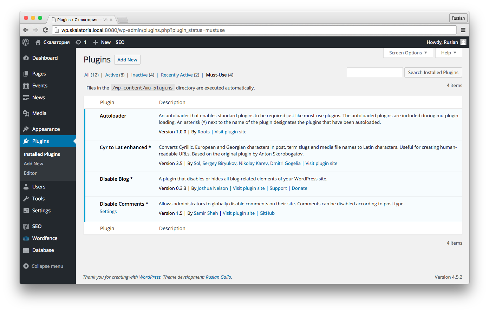

# Autoloader for WordPress

Autoloader is a WordPress plugin.

An autoloader that enables standard plugins to be required just like must-use plugins. The autoloaded plugins are included during mu-plugin loading. An asterisk (\*) next to the name of the plugin designates the plugins that have been autoloaded.

It is a fork [Bedrock Autoloader](https://github.com/roots/bedrock/blob/master/web/app/mu-plugins/bedrock-autoloader.php).

## Screenshots



## Install

Move `autoloader.php` file to folder `wordpress/wp-content/mu-plugins`, if any. If not, then create it.

## Install with Composer

Add to your `composer.json`:

```
"repositories":[
    {
        "type": "package",
        "package": {
            "type": "wordpress-muplugin",
            "name": "ruslangallo/wp-mu-autoloader",
            "version": "1.0.0",
            "source": {
                "type": "git",
                "url": "https://github.com/ruslangallo/wp-mu-autoloader",
                "reference": "master"
            }
        }
    },
    {
        "type": "composer",
        "url": "https://wpackagist.org"
    }
],
"require": {
    "php": ">=5.3.2",
    "johnpbloch/wordpress-core-installer": "~0.2",
    "johnpbloch/wordpress": "^4.5",
    "composer/installers": "^1.0",
    "ruslangallo/wp-mu-autoloader": "^1.0",
    "wpackagist-plugin/mu-plugin": "^1.0",
},
"extra": {
    "wordpress-install-dir": "wordpress",
    "installer-paths": {
        "wordpress/wp-content/mu-plugins": ["ruslangallo/wp-mu-autoloader"],
        "wordpress/wp-content/mu-plugins/{$name}": [
            "type:wordpress-muplugin",
            "wpackagist-plugin/mu-plugin"
        ],
        "wordpress/wp-content/plugins/{$name}": ["type:wordpress-plugin"],
        "wordpress/wp-content/themes/{$name}": ["type:wordpress-theme"]
    }
}
```

And install:

```
$ composer install
```

## Remove with Composer

```
$ composer remove ruslangallo/wp-mu-autoloader
$ composer install
```

**Warning! If you remove the Autoloader with Composer, removed all `mu-plugins` folder.**

## Authors

[Roots](https://roots.io/)
